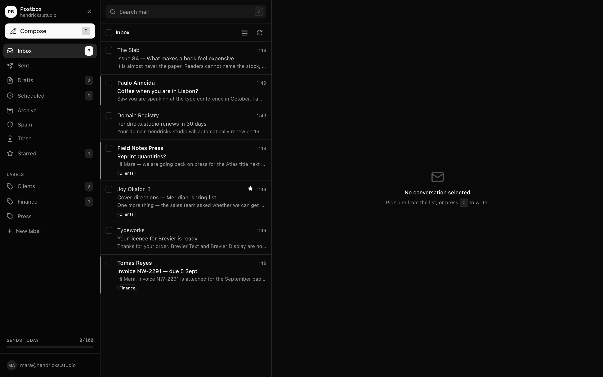
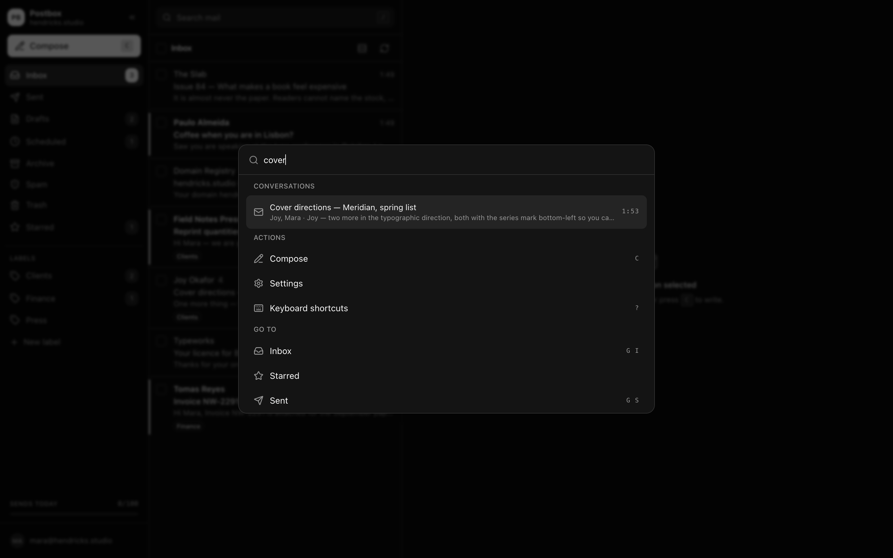
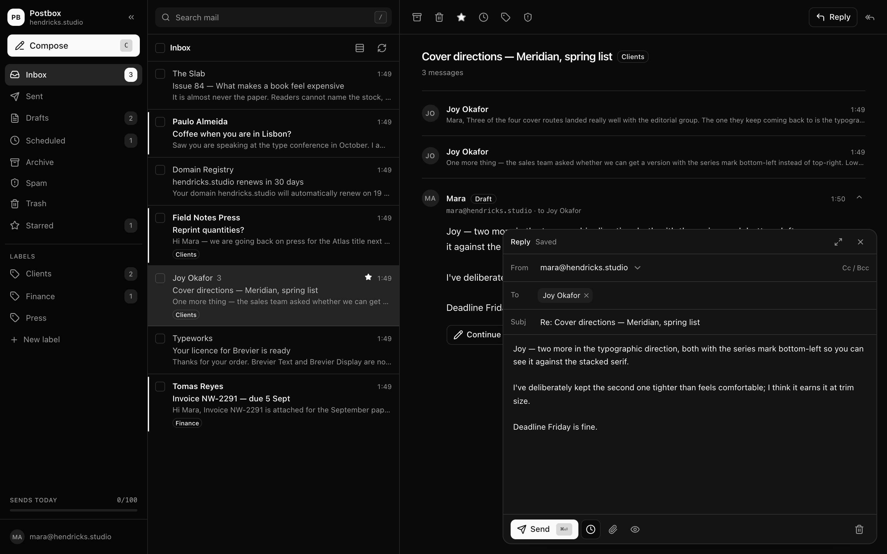
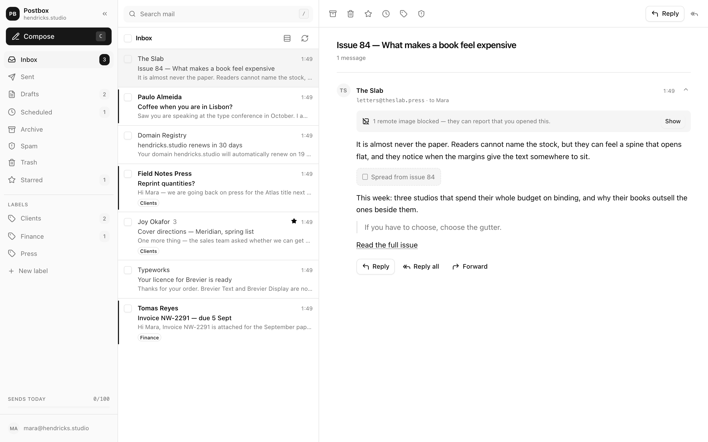
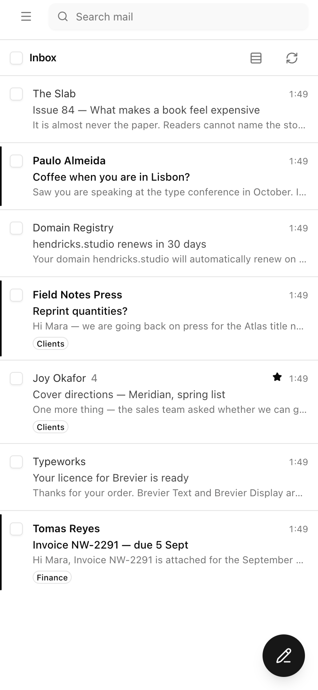
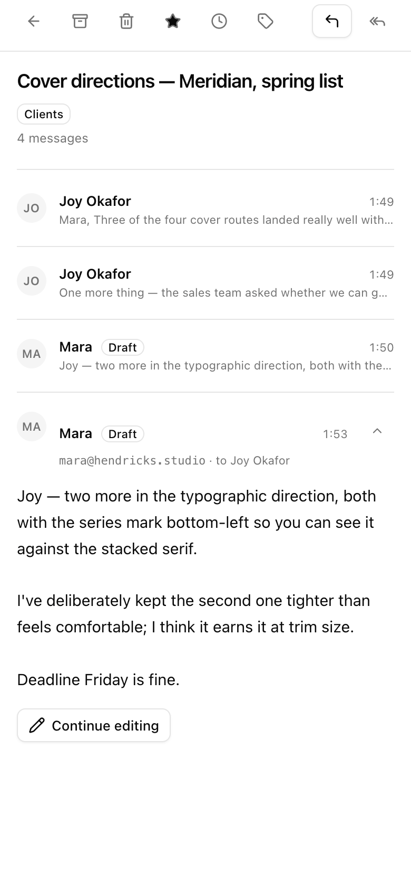
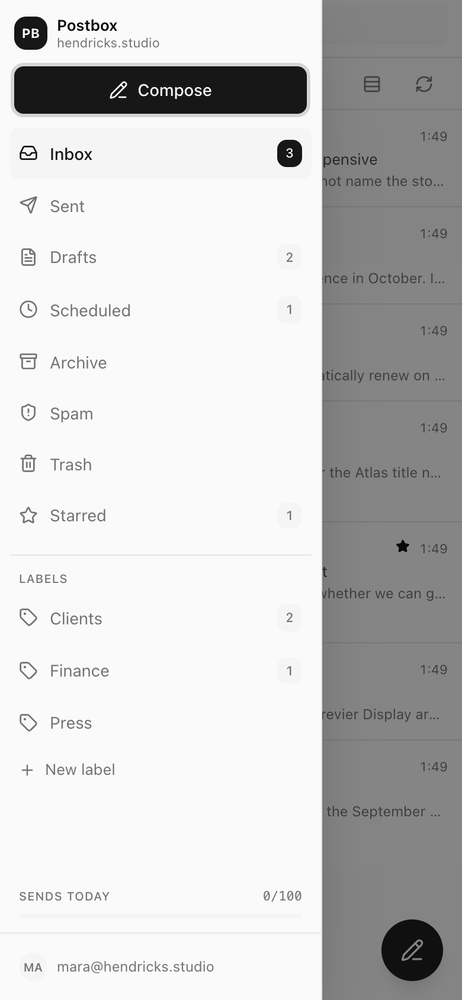
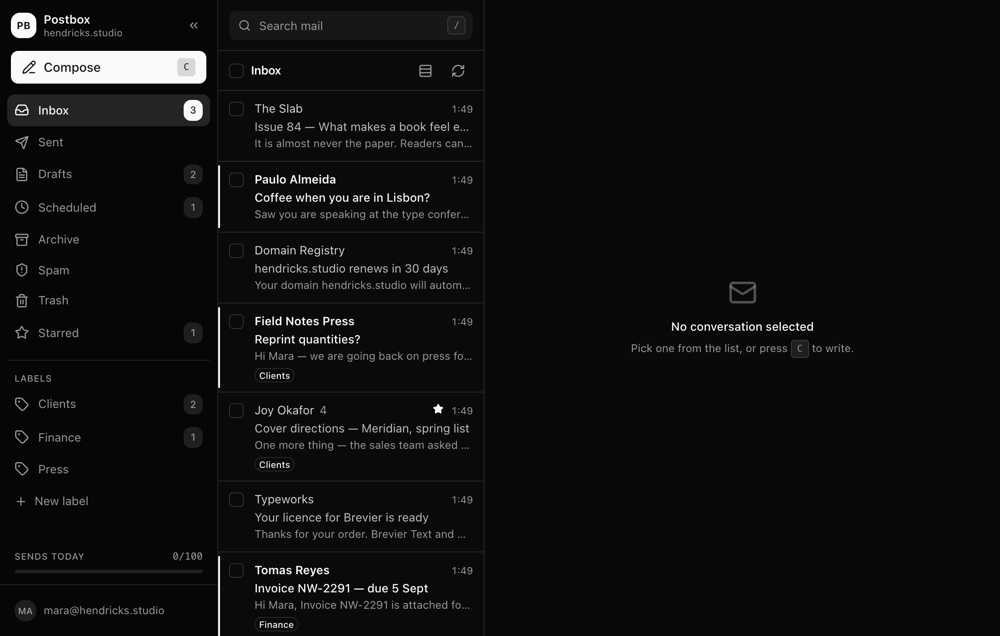

<div align="center">

# Postbox

**A real inbox for your own domain. Runs on Cloudflare's free tier. Costs nothing, forever.**

[Setup](#setup) · [What it costs](#what-it-costs) · [Commands](#commands) · [Architecture](docs/ARCHITECTURE.md) · [Deliverability](docs/DELIVERABILITY.md)

</div>



## The gap this fills

You bought a domain. You'd like `you@yourdomain.com`. Your options are Google Workspace at \$7 a user per month, Fastmail at \$5, or Zoho's free tier with its own asterisks.

Meanwhile Cloudflare will happily receive mail for your domain, unlimited, free, forever. The catch is that Email Routing only *forwards*. Everything lands in your personal Gmail, tangled up with newsletters and delivery notifications, and you can't reply as your domain without more setup.

Postbox is the other half. It takes the mail Cloudflare is already receiving for you and gives it somewhere to live: a fast, keyboard-driven client that you own, deployed to your own account, with your mail in your own database.

One command, and `anything@yourdomain.com` works.

```bash
cp .env.example .env    # three values
just up
```

## What it's like to use

**Every address receives immediately.** There are no aliases to create. `hi@`, `billing@`, `press@`, and the typo somebody made last Tuesday all land in the same inbox — a catch-all rule doing the work, for free. Sending as one of them is a separate line in Settings → Addresses: no DNS and no provider setup, but you do add the address before it appears in the composer's From menu.

**One inbox, and as many mailboxes as you need.** Because every address on the domain lands in one place, a busy domain can read as one undifferentiated pile. Name an address in Settings → Mailboxes — `billing@`, `support@`, the one you gave a single supplier — and it gets its own entry in the sidebar, with its own unread count, holding everything that address has ever received. Nothing is moved and nothing is hidden: the mail still arrives in your Inbox and is archived, starred and searched exactly as before. It is a second way in, not a filing cabinet, so trying one out costs nothing and removing it moves not one message. Settings offers the addresses that are already getting mail, so you pick from what is real rather than trying to remember.

**It's built for the keyboard.** `c` to write, `e` to archive, `j`/`k` to move, `g i` for the inbox, `⌘K` for everything else, and `?` for the list of all of them — which is also a button in the toolbar, because a shortcut you can only find by already knowing it is folklore rather than a feature. The palette doubles as search, so finding a two-year-old thread is one keystroke and three letters.



**Mail arrives, not eventually.** New messages appear the moment they land — no refresh, no waiting for a timer. A Durable Object holds a socket open to the tab and rings it when something arrives, and the tab title carries the unread count and your domain, so `(3) yourdomain.com · Postbox` in a background tab is enough to tell you. Desktop notifications and a chime are a switch away in Settings → Alerts. If the socket ever drops, the app quietly falls back to checking every fifteen seconds until it comes back.

**Writing is quick and forgiving.** The composer is a proper visual editor — bold, headings, lists, checklists and links from a toolbar or the shortcuts you already know, with `- ` and `# ` turning into a list and a heading as you type. Underneath it is still Markdown, and the Markdown is still there to edit directly (⌘⇧M) when you would rather write it out. Recipients autocomplete from people you actually correspond with, because the address book builds itself from your mail. Drafts save as you type. Undo send gives you eight seconds to change your mind, and if you close the tab in that window the message still goes, rather than vanishing.

A `mailto:` link in a message opens the composer here, filled in with whatever the link asked for — a mail client that hands its own links to another program is not really your mail client. Settings can take the rest of the browser's `mailto:` links too, so writing to an address anywhere lands in Postbox.



**Tracking pixels don't get a free pass.** Remote images are held back until you ask for them, and each message shows exactly how many were blocked. Every message also carries its SPF, DKIM and DMARC result, so "is this really my bank" has an answer instead of a vibe.



**It's a real phone app, not a squeezed desktop.** One pane at a time, navigation in a drawer, compose takes the full screen, and you can swipe a conversation away.

Add it to your Home Screen and it stops being a website: its own icon, its own window, no browser chrome — and **push notifications when mail arrives**, on iPhone and Android alike, with the app closed and the phone locked. There is nothing to download and no App Store account involved. On iPhone that's Share → Add to Home Screen, then Settings → Alerts from the installed app; on Android your browser offers to install it.

Notifications carry the sender and the subject, and they carry them privately: each one is encrypted to that device's own keys before it leaves your Worker, so Apple and Google relay bytes they cannot read. Replies to one conversation collapse into a single notification rather than stacking, signing out of a device stops it being notified, and Settings → Alerts lists every device that's registered so you can revoke one you don't recognise.

**The icon is yours.** Settings → Appearance takes the shipped envelope, the same envelope on your brand colour, a monogram, or your own logo — so the thing on your Home Screen looks like *your* mail, not a copy of somebody's app. Pick one and every device that installs it gets it.

<p align="center">
  
  
  
</p>

There's also send later, snooze, labels, templates, per-address signatures, starring, full-text search, attachments, light and dark, a brand colour of your own if grey is not your grey, a Trash that empties for good when you ask it to, and a running count of how many sends you have left today.

## Setup

You'll need a domain already on Cloudflare, [`just`](https://github.com/casey/just), and Node 20+ (or Bun).

Copy `.env.example` to `.env` and fill in three values:

| | |
|---|---|
| `DOMAIN` | The domain you want mail on. |
| `CLOUDFLARE_API_TOKEN` | From your Cloudflare dashboard. Or run `just login` instead, and pick an account. |
| `RESEND_API_KEY` | A free **Full access** key from [resend.com](https://resend.com/api-keys). Used once, at setup. |

Then:

```bash
just doctor   # optional, checks all three before you commit to anything
just up
```

That's the whole setup. Everything else is worked out for you: your account ID, your zone, the hostname (`mail.yourdomain.com`), the database, the sending domain and its DNS records, a scoped API key, a session secret, and a strong password for the UI, which is printed once when it's created.

A token that is only exported in your shell does not count as filled in. If `.env`
does not name one, `just up` asks which token to use — showing you the account it
belongs to — and writes your answer to `.env`, so the question is asked once and
the answer is on disk rather than in whichever terminal you happened to run from.
Where `.env` and your environment disagree, `.env` wins; in CI, where nobody can
answer a prompt, set `POSTBOX_ALLOW_ENV_TOKEN=1` to say the environment is meant.



When you're done, `just down` removes every single thing it made — and nothing else. If your zone was already receiving mail through Email Routing, or a DNS record was there before Postbox was, it says so before it asks you to confirm and then leaves those alone. Where it cannot tell whether something predates it, it keeps it: leaving a switch on is untidy, turning off mail for a domain is an incident.

### Why Resend is in here

Cloudflare receives mail for free but charges for sending: outbound needs the paid Workers plan. Since the point of this project is a mailbox that costs nothing, sending goes through Resend's free tier instead, and Postbox wires the whole thing up for you. It registers the domain, writes the DNS records into Cloudflare, and mints a send-only key scoped to your domain so your full-access key never leaves your laptop.

If you're ever on the Workers Paid plan anyway, one line in `.env` moves sending to Cloudflare and drops the third party entirely:

```bash
MAIL_PROVIDER=cloudflare
```

`just up` then skips the Resend setup, binds Cloudflare's sender to the Worker, and leaves `RESEND_API_KEY` unused. Your mail is untouched, and you can switch back just as easily. **This is not the free path** — it needs the $5/month Workers plan, which is exactly why it isn't the default.

## What it costs

Nothing. To be specific about it:

| | Free allowance | Enough for |
|---|---|---|
| Receiving | Unlimited | Everything |
| Push notifications | Unlimited | Every device you own |
| Sending | 100/day, 3,000/month | Personal and small-team use |
| Storage | 5 GB | Roughly 100,000 messages |
| Requests | 100,000/day | You, refreshing a lot |
| Real-time | 100,000 Durable Object requests/day | A tab open all day costs a few hundred |

No credit card, no paid Workers plan, no trial that expires. If you outgrow the sending limit, Resend's next tier is $20/month, or you can move to Cloudflare's own sending by swapping one file.

The live channel is free for a specific reason worth knowing: the Durable Object holding your socket open uses [hibernation](https://developers.cloudflare.com/durable-objects/best-practices/websockets/), so it is evicted from memory while the connection stays up and bills no duration at all. Keeping a socket awake the ordinary way would cost roughly 11,000 of the free plan's 13,000 GB-s per day for a single open tab — which is also why this is a WebSocket and not server-sent events, since SSE has no hibernation to fall back on.

## Commands

| | |
|---|---|
| `just up` | Deploy. Safe to run again. |
| `just down` | Remove what Postbox created, and only that. |
| `just dev` | Run it locally. |
| `just doctor` | Check your setup before deploying. |
| `just verify` | Nudge Resend to re-check DNS. |
| `just mailcheck` | Every record a receiving mail server checks, and what it concludes. |
| `just secrets` | Where your password and keys live. |
| `just logs` | Tail the live logs. |
| `just sql "..."` | Query your mail directly. |
| `just icons` | Redraw the default app icon. |

Set `STAGE=staging` in `.env` and you get a completely separate copy, with its own database and hostname, on the same domain.

## Good to know

The inbox is behind a single password, because a public URL that can send mail from your domain is a spam relay waiting to happen. The app is served only on your own hostname; the `*.workers.dev` address is switched off, so there's one door rather than two.

If you already run Cloudflare Zero Trust, you can put Access in front of `mail.yourdomain.com` for proper SSO. Postbox doesn't set that up for you, because Cloudflare's onboarding asks for a payment method even on the free Zero Trust tier, and this project promises you'll never be asked for a card. [The architecture notes](docs/ARCHITECTURE.md#putting-cloudflare-access-in-front) explain how to wire it up if you want it.

**Settings → Access** records every sign-in, every refused password and every change made through the app, with the address, country and device behind it, kept for 90 days. With one shared password the useful question is not *who* but *which sign-in*, so each row is tagged with the session it belongs to — a wrong password from an address that isn't yours is the row you are looking for. Reading mail is not recorded, and no message content is stored there.

Your mail lives in your own Cloudflare D1 database. Nobody else can read it, there's no analytics, and there's nothing to export because it was never anywhere else.

**Landing in the inbox is its own problem.** A mailbox you buy with a domain comes with somebody else's twenty-year-old sending reputation attached; a domain you set up yesterday has none, and receivers treat those two very differently no matter how correct your DNS is. Postbox publishes everything a receiver checks — SPF, DKIM, DMARC with reporting turned on, TLS-RPT, optionally MTA-STS — sends messages shaped like personal mail rather than like a campaign, and checks each draft for the things filters actually penalise. `just mailcheck` reports on all of it. What it cannot do is buy you reputation: that takes a few weeks of modest volume and, above all, replies. [docs/DELIVERABILITY.md](docs/DELIVERABILITY.md) is the whole picture, including the warmup ramp and when to tighten your DMARC policy.

Postbox is for personal and small-team mail. It is not a marketing platform, and Resend's free tier will (correctly) stop you using it as one.

More on how it fits together, including the data model and the deployment story, is in [docs/ARCHITECTURE.md](docs/ARCHITECTURE.md). Getting read rather than filtered is in [docs/DELIVERABILITY.md](docs/DELIVERABILITY.md).

## License

MIT. Use it, fork it, run it for your whole family, sell the T-shirts.

---